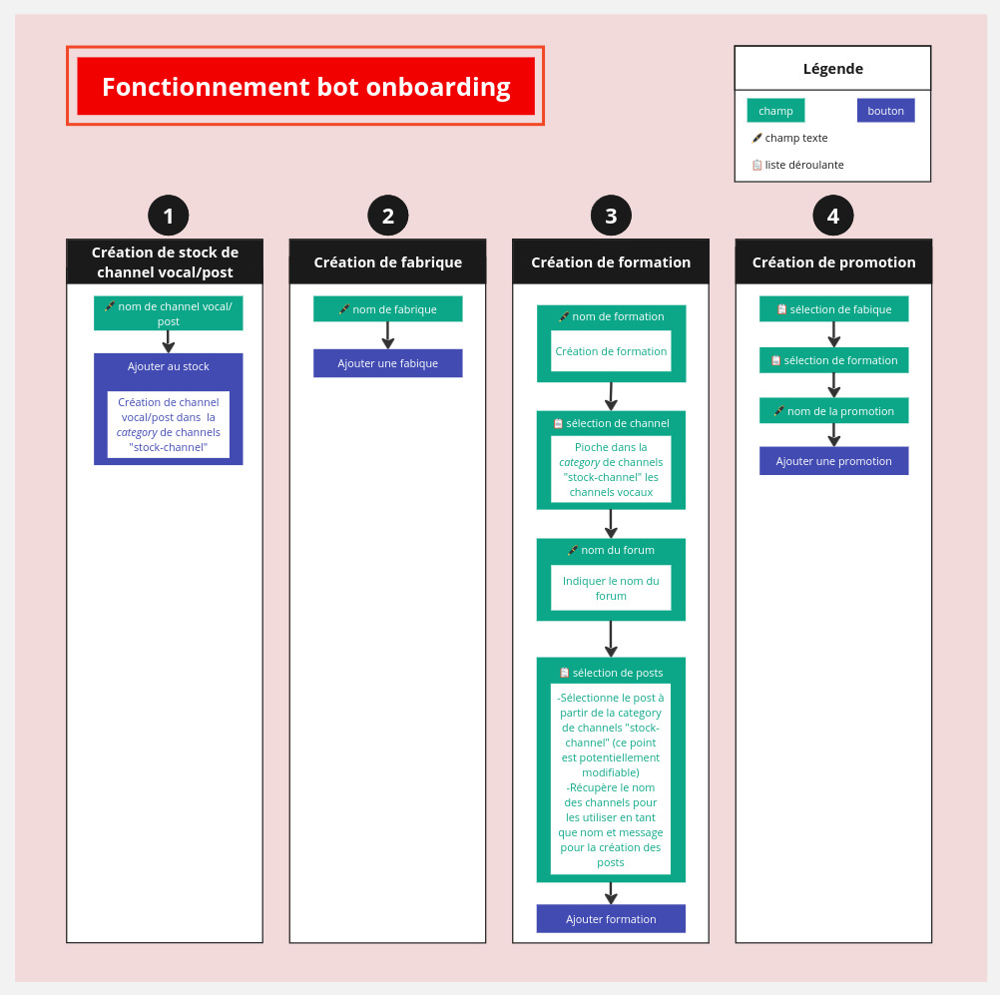

## Objet : Remerciements et compte-rendu suite au rendez-vous du _23-10-24_

Bonjour Benjamin,

Nous tenons à te remercier sincèrement pour le temps précieux que tu nous as accordé lors de notre rencontre du **mercredi 23 octobre 2024 à 16h15**.

Ce fut un véritable plaisir d'échanger avec toi, et nous avons particulièrement apprécié la qualité de tes retours ainsi que de ta démonstration.

Tes réponses, idées et suggestions ont été extrêmement enrichissantes pour nous, et elles contribueront sans aucun doute à la réussite de ce projet.

Durant notre rendez-vous, nous avons discuté des points suivants :

- Le fait qu'il y ait eu un mélange channel textuel/forum sur Simplon HDF
- La pertinence du stock de channels
- Mettre des stocks pour les posts
- Les permissions de l'apprenant lié à la création de posts
- Les permissions du formateur lié à la création de posts
- L'existence de la permission administrateur et sa différence avec le rôle administrateur
- La clarification de la nomenclature du forum cloud
- La clarification de la nomenclature des rôles
- Clarification du rôle staff
- Pertinence du schéma fonctionnel fourni
- La possibilité pour le bot de modifier les rôles dans un forum privé après sa création a été discutée.
- Lors de l'identification, la pertinence d'ajouter des rôles comme "formateur" ou "invité" a été évoquée.
- La suppression de la fabrique et la formation
- Potentielle limitation du nombre de personnes dans les channels
- Kickage d'apprenants sur les channels vocaux temporaires

Par rapport aux points ci-dessus, nous avons compris que :
- Le mélange channel textuel/ forum sur Simplon HDF est dû à un manque de temps et n'était donc pas volontaire.
- Le stock de channels est disponible en privé sur le serveur discord Simplon HDF au sein d'une *category*.
- Si on partait de la V1 du bot onboarding, on utiliserait le stock de channel évoqué précédemment afin d'utiliser les noms des dits channels pour créer des posts, en tant que nom et message lors de leur création.
- Le apprenants ne doivent pas avoir la possibilité de créer des posts.
- Sous réserve d'une approbation de Claire, les formateurs pourront créer autant de posts qu'ils le désireront dans leur promotion.
- La permission administrateur est une permission propre à discord.
- Le "forum cloud" tel que nous l'avons vu sur la documentation fournie par Claire est bien un forum unique, il ne posera donc pas de problème.
- Sous réserve d'une approbation de Claire, il faudra renommer les rôles admins et administrateur afin d'éviter toute confusion.
- Concernant le rôle staff, il y aura une liste de rôle qui sera attribuée à la volée, pour la personne concernée pour qu'elle puisse accéder aux catégories de channels nécessaires dans le cadre de ses fonctions.
- Le schéma fonctionnel fourni est toujours pertinent.
- Il faut ajouter une flèche entre le dashboard et le bot discord dans le schéma.
- La création de forum privé n'est pas pertinente dans le cadre du bot discord.
- Lors de l'identification, la possibilité d'ajouter des rôles comme "formateur" ou "invité" n'est pas exclue.
- La suppresion de fabrique pouvait entrainer un choix de la suppression des promotions liées à une fabrique.
- Le suppression de formation entraine obligatoirement la suppression des promotions actives.
- Lors de la création d'un channel dans un stock de channel, rajouter une option pour limiter le nombre de personnes.
- Sous réserve d'un acceptation de Claire, il peut être envisagé de mettre en place un système de kickage des apprenants dans les salons vocaux temporaires.

Suite à la démonstration du bot discord nous avons compris que :

- Les listes déroulantes où sont stockées les channels ont une limitation de 25.
- Pour initier l'interface nous utilisons une commande (exemple : ##configuration).
- Les messages avec un fond bleu envoyés par le bot sont des messages privés pour la personne initiant le bot.
- Le fonctionnement de la configuration du bot pour calibrer les rôles.
- Le fonctionnement de la Category discord et son ciblage dans la création de la nouvelle formation.
- L'abandon du concaténage pour le nommage des promos.
- Les noms de channels peuvent être utilisés en tant que nom de post au moment de leur création.

(Schéma récapitulatif des étapes en fichier joint)

À l'issue de notre discussion, nous avons convenu des actions suivantes :

- Réalisation de test du bot par l'équipe en interne.
- Révision des règles de gestion.
- Révision des users stories.
- Demander un second avis au client non tech.
- En dehors des stocks, abandon total des channels textuels. 

Si tu as des réserves sur un des points évoqués plus haut, d'autres éléments à ajouter ou des sujets que tu souhaiterais aborder lors de nos prochains échanges; n’hésite pas à nous en faire part. Nous sommes très heureux de collaborer avec toi et sommes enthousiastes à l'idée d'avancer ensemble sur les prochaines phases du projet.

Nous restons bien entendu à ta disposition pour toute question complémentaire. Aussi, n'hésite pas à revenir vers nous si tu as besoin de précisions sur les points abordés lors de notre rendez-vous.

Dans l’attente de te lire, nous te souhaitons une excellente journée.

Bien cordialement,

**Aurore Reynier**

Le groupe Discord onboarding

Le schéma inclu:

