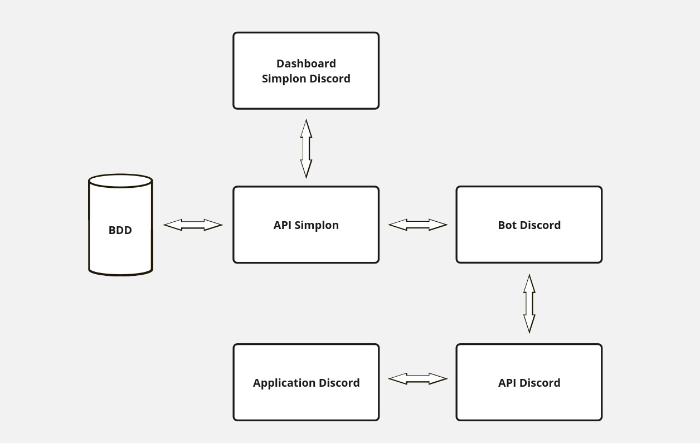

## Schéma fonctionnel Discord

### Limitations de Discord

**500 channels maximum par serveur :**
    Discord limite le nombre total de channels (textuels et vocaux) à 500. Il est donc important d'organiser efficacement les channels pour ne pas dépasser cette limite.

**200 rôles maximum par serveur :**
    Un serveur Discord peut avoir jusqu'à 200 rôles. Cela implique de bien structurer les rôles pour éviter toute surcharge ou duplication.

### Rôles

- Dev
- CDP
- Formateur
- CM
- Directeur
- Admin
- Administrateur
- Pedago
- Staff
- Com
- Partenaire
- Mentor

### Lieux

- Lille
- Valenciennes
- Roubaix
- Bethune
- Lens
- Boulogne

## Onboarding par promo - forums et chans

### Par promo 

- **Forum Apprenants**
    
    - Général
    - Absences/retard
    - Signature
    - Détente/Zoo
    - Briefs/Fil rouge

***Le formateur doit avoir la possibilité de rajouter des forums (par exemple "point de fin de semaine" etc..).***

- Channels vocaux

    - On demand
    - SOS

- **Forum pédago**
    - Orga

### Architecture par famille de métier

- **Forum DEV**
    - HTML/CC
    - PHP
    - COBOL
    - JS/TS
    - C#
    - Java
    - Python
    - BDD
    - GIT/ GITHUB
    - IDE
    - Container
    - ORM
    - MAC
    - Linux
    - Windows
    - Terminal

- **Forum Infra**
    - Hardware
    - Virtualisation
    - Stockage
    - Pare Feu
    - Supervision
    - Réseaux
    - Windows Desktop
    - Windows Server
    - Linux
    - MAC
    - Android/IOS
    - OS int
    - Pentest
    - containers
    - orchestrations containers
    - automatisation
    - Scripting

- **Forum Data IA**
    - HTML/CSS
    - Containers
    - Linux
    - Django
    - IDE
    - BDD
    - Machine Learning 
    - Data
    - Azure
    - prompt Engineering
    - Terminal
    - Notion
    - Scrapping
    - Déploiement
    - Agilité
    - Gestion de projet

- **Forum Cloud**
    - Containers
        - Docker
        - ACI
        - LCX
    - Orchestrateurs
        - Kubernates
        - Docker swarm
        - Puppet
    - IAC
        - Packer
        - Terraform
        - Ansible
        - Python
    - Virtualisation
        - VMWarz
        - Vagrant
        - Proxmox
        - Hypervison
    - Pipeline
        - Jenkins
        - Gitlab
        - Azure Devops
    - Cloudcomputing
        - Azure
        - Open Nebulla
        - Openstack
    - Schématisation
        - Draw.io
        - Cloudcraft
        - Visual Paradigm
        - Cloudockit
    - Gestion de projet
        - Scrum
        - Agilité
    - Langages
        - YAML
        - JSON
        - Python
        - PowerShell
        - Shell
        - SQL

- **Forums de Développement**
- **Forum HTML/CSS**
    - Responsive Design
    - Frameworks
    - SASS
    - Bootstrap
- **Forum PHP**
    - Laravel
    - Symfony
    - Wordpress
    - Composer
- **Forum COBOL**
    - Mainframe
    - JCL
    - DB2
    - Modernisation
- **Forum JavaScript/TypeScript**
    - NodeJS
    - React
    - Angular
    - VueJS
    - ES6
- **Forum C#**
    - .NET
    - ASP.NET
    - Unity
    - Xamarin
    - WPF
- **Forum Java**
    - Spring
    - Hibernate
    - J2EE
    - Maven
- **Forum Python**
    - Django
    - Flask
    - Data Science
    - Machine Learning
 - **Forum Base de données (BDD)**
    - MySQL
    - PostgreSQL
    - MongoDB
    - SQL Server
- **Forum GIT/GitHub**
    - Branching
    - Merging
    - CI/CD
    - Repositories

- **Forums d'Infrastructure**
- **Forum Hardware**
    - CPU
    - GPU
    - RAM
    - Storage
- **Forum Virtualisation**
    - VMWare
    - Hyper-V
    - KVM
- **Forum Stockage**
    - SAN
    - NAS
    - Cloud Storage
 - **Forum Pare-feu**
    - Configuration
    - Sécurité
    - Règles
 - **Forum Supervision**
    - Outils de monitoring
    - Performance
    - Alerting
- **Forum Réseaux**
    - Routing
    - Switching
    - TCP/IP
    - VPN
- **Forum Windows Desktop**
    - Installation
    - Configuration
    - Dépannage
- **Forum Windows Server**
    - Active Directory
    - IIS
    - PowerShell
- **Forum Android/iOS**
    - Développement d'applications
    - Mises à jour système
    - Sécurité

